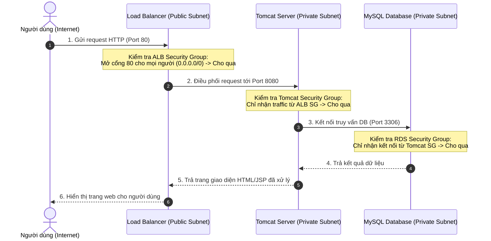

# LUỒNG HOẠT ĐỘNG CỦA HẠ TẦNG (AWS 3-TIER ARCHITECTURE)

Hướng dẫn chi tiết về luồng hoạt động (flow) của hệ thống hạ tầng 3 lớp vừa xây dựng bằng Terraform.

---

## 1. Khái Niệm Cơ Bản: Kiến Trúc 3 Lớp (3-Tier Architecture) Là Gì?

Kiến trúc 3 lớp là một mô hình thiết kế phần mềm và hạ tầng kinh điển, chia hệ thống thành 3 phân vùng độc lập để đảm bảo **Bảo mật**, **Tính sẵn sàng cao** và **Dễ dàng mở rộng**:

1.  **Lớp Trình diễn (Presentation Tier / Web Tier):** Nơi tiếp nhận yêu cầu từ người dùng (ở đây là Bộ cân bằng tải ALB tiếp nhận cổng 80).
2.  **Lớp Ứng dụng (Application Tier / App Tier):** Nơi xử lý logic nghiệp vụ (ở đây là cụm máy chủ EC2 chạy Apache Tomcat cổng 8080).
3.  **Lớp Dữ liệu (Data Tier):** Nơi lưu trữ thông tin (ở đây là cơ sở dữ liệu Amazon RDS MySQL cổng 3306).

---

## 2. Bản Đồ Mạng Hạ Tầng (Network Topology)

Sơ đồ dưới đây mô tả cách phân chia vùng mạng trong VPC của bạn:

```
+---------------------------------------------------------------------------------------------------+
| AWS Cloud (Region: us-east-1)                                                                     |
|                                                                                                   |
|  +---------------------------------------------------------------------------------------------+  |
|  | VPC (Dải IP: 192.168.0.0/16)                                                                |  |
|  |                                                                                             |  |
|  |   [Internet Gateway (IGW)] <==========================> (Internet Công Cộng)                |  |
|  |              ^                                                                              |  |
|  |              | (Định tuyến thông qua Public Route Table)                                    |  |
|  |              v                                                                              |  |
|  |   +-------------------------------------------------------------------------------------+   |  |
|  |   | VÙNG CÔNG CỘNG (PUBLIC SUBNETS)                                                     |   |  |
|  |   | - Có IP Public, kết nối trực tiếp với Internet.                                     |   |  |
|  |   |                                                                                     |   |  |
|  |   |   [Application Load Balancer (ALB)]                                                 |   |  |
|  |   |   - Đón khách tại cổng 80 (HTTP)                                                    |   |  |
|  |   |                                                                                     |   |  |
|  |   |   [NAT Gateway] <------------------------------------+                              |   |  |
|  |   |   - Cổng đi internet 1 chiều cho vùng Private        |                              |   |  |
|  |   +------------------------------------------------------|------------------------------+   |  |
|  |                                                          | (Định tuyến qua Private RT)         |
|  |                                                          v                                  |
|  |   +-------------------------------------------------------------------------------------+   |  |
|  |   | VÙNG RIÊNG TƯ (PRIVATE SUBNETS)                                                     |   |  |
|  |   | - KHÔNG có IP Public, hoàn toàn cô lập khỏi Internet bên ngoài.                     |   |  |
|  |   |                                                                                     |   |  |
|  |   |   [Cụm Máy Chủ EC2 - Tomcat (ASG)] <-----------------+                              |   |  |
|  |   |   - Chạy ứng dụng Java Login (cổng 8080)             |                              |   |  |
|  |   |                                                      |                              |   |  |
|  |   |   [Cơ Sở Dữ Liệu RDS MySQL] <------------------------+                              |   |  |
|  |   |   - Lưu trữ dữ liệu người dùng (cổng 3306)                                          |   |  |
|  |   +-------------------------------------------------------------------------------------+   |  |
|  +---------------------------------------------------------------------------------------------+  |
+---------------------------------------------------------------------------------------------------+
```

---

## 3. Luồng Đi Của Một Yêu Cầu (Request Traffic Flow)

Khi một người dùng mở trình duyệt và truy cập vào ứng dụng này, luồng dữ liệu sẽ đi qua các chặng sau:



---

## 4. Luồng Tự Động Kết Nối Trong Terraform (Variable & Output Flow)

Để các module mạng, bảo mật, database và máy chủ có thể làm việc ăn khớp với nhau, Terraform chuyền dữ liệu qua lại theo luồng sau:

1.  **VPC Module** khởi tạo mạng xong -> Xuất ra **`public_subnet_ids`** và **`private_subnet_ids`** (ở file `outputs.tf` của VPC).
2.  **Security Module** nhận `vpc_id` từ VPC -> Tạo ra các nhóm bảo mật -> Xuất ra **`alb_security_group_id`**, **`tomcat_security_group_id`**, và **`rds_security_group_id`**.
3.  **RDS Module** nhận `private_subnet_ids` từ VPC và `rds_security_group_id` từ Security -> Tạo Database thành công -> Xuất ra địa chỉ kết nối **`db_hostname`** (ví dụ: `database.crxxxx.us-east-1.rds.amazonaws.com`).
4.  **ASG Module (EC2)** nhận:
    *   `private_subnet_ids` từ VPC (để biết chỗ đặt máy chủ).
    *   `tomcat_security_group_id` từ Security (để gán tường lửa).
    *   `target_group_arn` từ ALB (để tự đăng ký vào bộ cân bằng tải).
    *   **`db_hostname` từ RDS** (để truyền địa chỉ cơ sở dữ liệu vào cấu hình của ứng dụng).

```
[VPC Module] ----(subnet_ids)----> [RDS Module] ----(db_hostname)----+
     |                                                               |
     |                                                               v
     +-----------(subnet_ids)---------------------------------> [ASG Module]
     |                                                               ^
     v                                                               |
[Security Module] --(tomcat_sg_id)-----------------------------------+
```

---

## 5. Luồng Cấu Hình Khởi Động Ứng Dụng (Bootstrapping Flow)

Khi một máy chủ ảo EC2 mới được Auto Scaling Group kích hoạt khởi động trong Private Subnet, các bước sau sẽ tự động diễn ra:

1.  **Hạ tầng kích hoạt:** EC2 khởi động và đọc mã kịch bản khởi tạo **`user_data`** đã được Terraform biên dịch sang dạng Base64.
2.  **Cài đặt môi trường:** Kịch bản chạy lệnh cập nhật hệ thống, cài đặt **Java 11 (Corretto)** và máy chủ **Apache Tomcat**.
3.  **Chèn biến môi trường:** Lệnh `echo "DB_HOST=..." >> /etc/tomcat/tomcat.conf` được thực thi. Terraform đã tự động điền địa chỉ RDS thực tế vào chỗ `...` này từ trước.
4.  **Khởi động dịch vụ:** Dịch vụ Tomcat được bật lên. Nó sẽ đọc file cấu hình hệ thống `/etc/tomcat/tomcat.conf` và nạp biến `DB_HOST` vào bộ nhớ hệ thống.
5.  **Chạy ứng dụng:** Khi file ứng dụng `.war` khởi chạy trong Tomcat, Spring Boot sẽ tìm biến môi trường `${DB_HOST}` trong bộ nhớ (nhờ dòng cấu hình `spring.datasource.url = jdbc:mysql://${DB_HOST:localhost}:3306/UserDB`) để thực hiện kết nối thẳng tới RDS MySQL.

---
